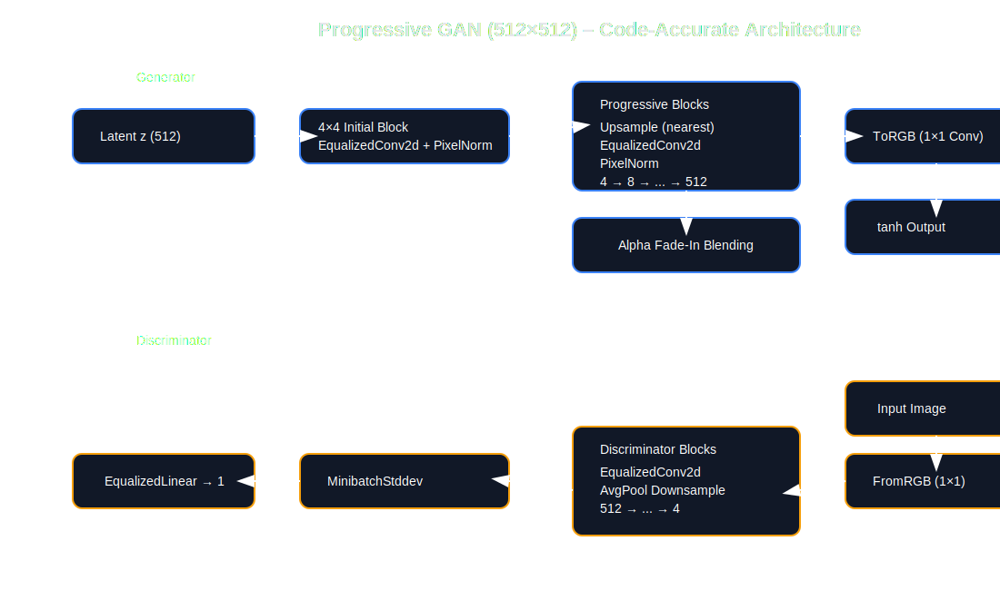

# ProGAN-Face-Generator
# 🎨 Progressive GAN: High-Resolution Face Synthesis (512×512)

[](YOUR_HUGGING_FACE_SPACE_LINK_HERE)


This repository implements a **Progressive Growing GAN (ProGAN)** in PyTorch, capable of generating high-quality human face images up to **512×512 resolution**.

The architecture follows the ideas from:

**Tero Karras et al. — “Progressive Growing of GANs for Improved Quality, Stability, and Variation” (2017)**

The model is deployed using **Gradio** and available via Hugging Face Spaces.

---

## ✨ Key Features

- 🚀 **Progressive Growing:** Seamless growth from 4×4 → 512×512 using fade-in blending (`alpha`)
- ⚖ **Equalized Learning Rate:** Runtime weight scaling for stable signal propagation
- 🎯 **Pixel-wise Feature Normalization**
- 📊 **Minibatch Standard Deviation Layer**
- 🔁 **SLERP Latent Interpolation**
- 🌐 **Gradio Web Interface**
- 🧠 **EMA Generator Weights for Inference**

---

## 🖼️ Sample Results

| Random Generation | Latent Interpolation |
|-------------------|----------------------|
|  |  |

> Replace with images from your Hugging Face Space for maximum impact.

---

## 📐 Model Architecture

### Generator (Progressive Growing)

- Starts from 4×4 latent projection
- Upsampling blocks double resolution each stage
- `EqualizedConv2d` in all convolution layers
- PixelNorm after each conv layer
- `ToRGB` 1×1 convolution at each resolution
- Fade-in blending during transitions

### Discriminator

- Mirror of generator (reverse order)
- `FromRGB` layer at every resolution
- Downsampling blocks
- `MinibatchStddev` layer before final block
- Final `EqualizedLinear` classification layer

---
## 🏗 Architecture Diagram



---

## 🧪 Technical Deep Dive

### 1️⃣ Equalized Learning Rate

Instead of relying only on careful initialization, weights are scaled at runtime:

```
w_scaled = w * sqrt(2 / fan_in)
```

This ensures equal learning speed across layers and stabilizes training.

Implemented in:

```
layers.py → EqualizedConv2d
layers.py → EqualizedLinear
```

---

### 2️⃣ Pixel-wise Feature Normalization

To prevent escalation of signal magnitudes in the generator:

```
b(x,y) = a(x,y) / sqrt(mean(a(x,y)^2) + ε)
```

Applied after every convolution layer in the generator.

---

### 3️⃣ Minibatch Standard Deviation

Encourages diversity in generated samples by adding batch-level statistics as an extra feature map.

Implemented in:

```
layers.py → MinibatchStddev
```

---

### 4️⃣ Progressive Fade-in (Alpha Blending)

During resolution transitions:

```
output = alpha * new_path + (1 - alpha) * old_path
```

This ensures smooth training when increasing resolution.

---

### 5️⃣ SLERP Interpolation

Spherical Linear Interpolation between two latent vectors:

```
SLERP(z1, z2, α)
```

Produces smooth semantic transitions between generated faces.

Implemented in:

```
inference.py → _slerp()
```

---

## 📊 Training Details

- Dataset: CelebA-HQ (30,000 images)
- Final Resolution: 512×512
- Latent Dimension: 512
- Training Steps: 650,000
- EMA Weights Used for Inference
- Progressive growing schedule implemented manually

---
## 🏋️ Training Methodology

### Progressive Growing Strategy

Training begins at **4×4 resolution** and progressively doubles:

```
4 → 8 → 16 → 32 → 64 → 128 → 256 → 512
```

At each resolution stage:

1. Stabilization phase (alpha = 1.0)
2. Transition phase (alpha increases from 0 → 1)

This prevents sudden distribution shifts when increasing resolution.

---

### Loss Function

Standard GAN objective:

Generator:
```
min_G  E[log(1 - D(G(z)))]
```

Discriminator:
```
max_D  E[log(D(x))] + E[log(1 - D(G(z)))]
```

(EMA weights used during inference)

---

### Optimizer Configuration

- Optimizer: Adam
- Beta1: 0.0
- Beta2: 0.99
- Learning Rate: 1e-3 (progressively tuned)
- Equal learning rate scaling applied to all layers

---

### Exponential Moving Average (EMA)

During training, a shadow generator with exponential moving average weights is maintained:

```
θ_ema = β * θ_ema + (1 - β) * θ
```

EMA weights produce smoother and higher-quality samples during inference.

---

### Stabilization Techniques Used

- Equalized Learning Rate
- Pixel Normalization
- Minibatch Standard Deviation
- Fade-in Alpha Blending
- SLERP interpolation in latent space

---

### Hardware

- GPU: (Add your GPU here)
- Dataset size: 30k images
- Total steps: 650,000
- Final resolution: 512×512

---

## 🛠️ Project Structure

```
.
├── app.py              # Gradio UI
├── inference.py        # Image generation + SLERP
├── model.py            # Generator & Discriminator
├── layers.py           # Custom layers
├── requirements.txt
└── README.md
```

---

## 🚀 Getting Started

### 1️⃣ Clone Repository

```bash
git clone https://github.com/YourUsername/ProGAN-Face-Generator.git
cd ProGAN-Face-Generator
```

### 2️⃣ Install Dependencies

```bash
pip install -r requirements.txt
```

---

## ▶ Run Locally

```bash
python app.py
```

Then open:

```
http://localhost:7860
```

---

## 🌐 Live Demo

Access the deployed version on Hugging Face Spaces:

👉 **https://huggingface.co/spaces/cds006/Progan**

---

---

## 🙌 Acknowledgments

Inspired by:

Tero Karras et al., 2017  
Progressive Growing of GANs for Improved Quality, Stability, and Variation

---

⭐ If you found this project interesting, consider giving it a star!
